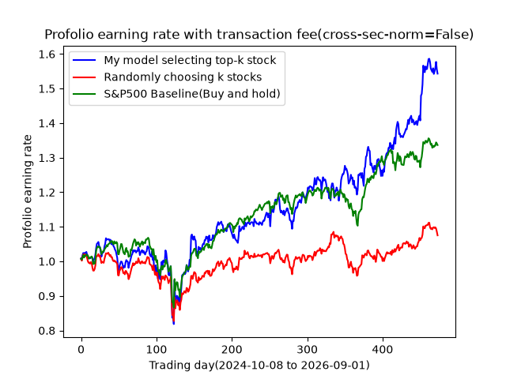
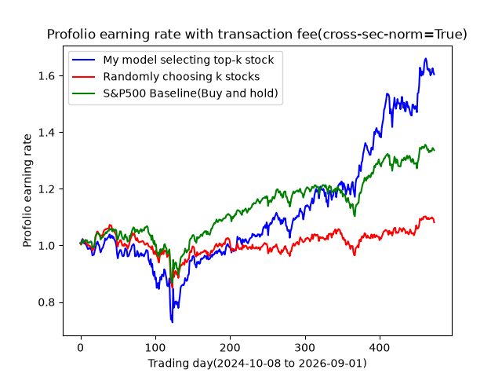

 # Stock Prediction

This project uses historical stock data and technical features to train a LightGBM model. The model ranks stocks by predicted next-day return and backtests a portfolio containing the top 50 stocks.

## File structure

```text
profolio.py              Main script and backtest
requirements.txt         Python dependencies
data/
	download_data.py       Download prices and generate features
	feat_eng.py            Technical feature calculations
	load_data.py           Load and filter stock data
	preprocess.py          Normalization and train-validation split
model/lightGBM.py        LightGBM training function
save/data/               Downloaded raw data
save/features_20/        Generated feature data
result/                  Charts and quantitative reports
train/                   Training-related scripts
```

## Run the project

Requirements:

- Python 3.10 or newer
- Internet access for downloading data with `yfinance`
- (Optional) I encourage to use Anaconda to create seperate env
From the project root, run:

```powershell

conda activate [your_new_env]
pip install -r requirements.txt
python profolio.py
```

`profolio.py` will:

1. Download missing stock price data.
2. Generate the selected 20 features.
3. Remove stocks with incomplete data.
4. Optionally apply cross-sectional normalization with `cross_norm`.
5. Split the data into training and validation periods.
6. Train the LightGBM model.
7. Backtest the top-50 portfolio after transaction costs
8. Provide Quantitative result
(the backtesting and quantitative result will be stored in result/profolio and result/quantitative)

To compare normalization settings, change this line in profolio.py and run the script again:

```python
cross_norm = True
```

## Results

The script saves:

- A portfolio chart in `result/profolio/`
- A quantitative report in `result/quantitative/`

The report includes annualized return, S&P 500 return, Sharpe ratio, maximum drawdown, mean Rank IC, ICIR, positive IC days, and a Sharpe ratio confidence interval. The backtest also compares the model portfolio with a random portfolio and the S&P 500.

### Portfolio performance





### Quantitative results

| Metric | Without normalization | With normalization |
|---|---:|---:|
| Annualized return | 25.37% | 28.02% |
| S&P 500 annualized return | 16.23% | 16.23% |
| Sharpe ratio | 1.05 | 1.08 |
| Maximum drawdown | -23.27% | -29.92% |
| Mean IC | 0.0095 | 0.0107 |
| ICIR | 0.07 | 0.08 |
| Positive IC days | 51.27% | 54.85% |

Normalization increased the annualized return and ranking performance slightly, but it also increased the maximum drawdown.

Full reports:

- [Without normalization](result/quantitative/k=50_cross-norm=False.txt)
- [With normalization](result/quantitative/k=50_cross-norm=True.txt)

## Future work

- Construct a more realistic transaction-cost and turnover profolio testing.
- Add risk consideration(Risk model), position constraints, and volatility adjustment.
- Test more models and measure the contribution of each feature(feature visualization is possible?).

